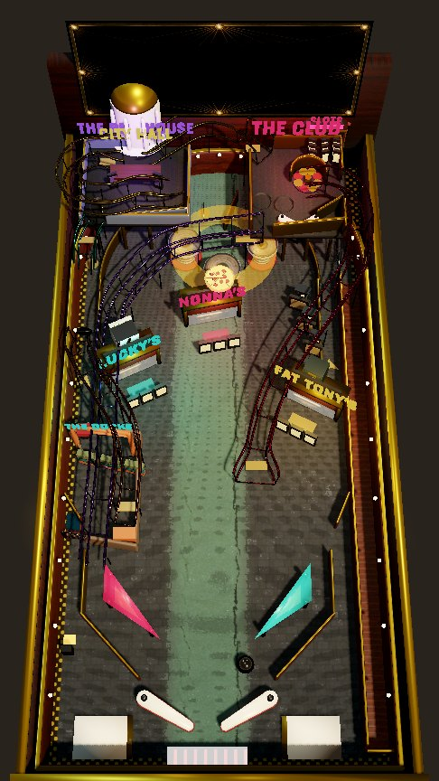
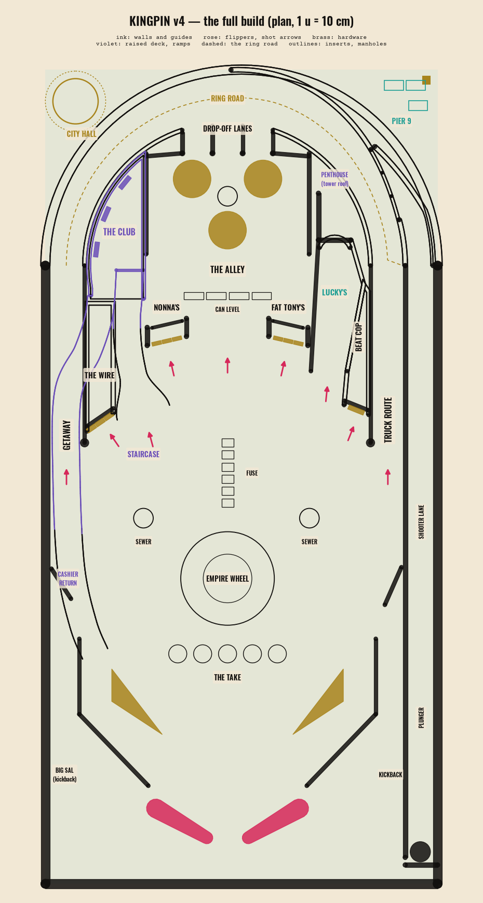
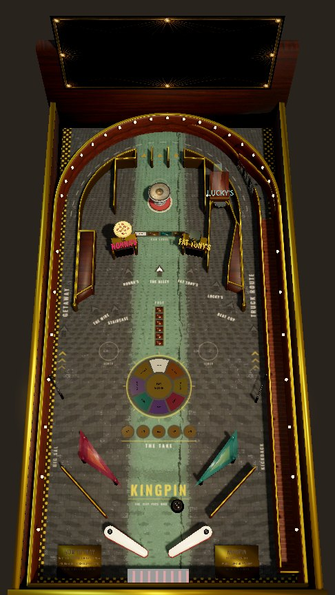
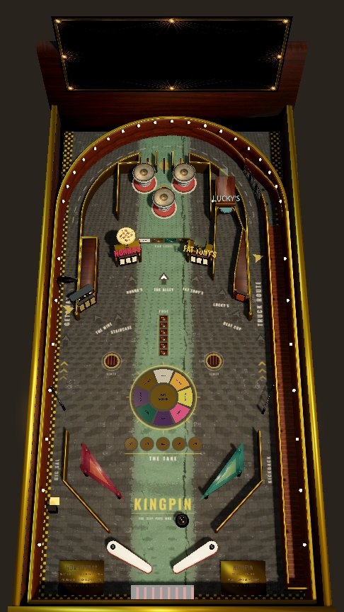
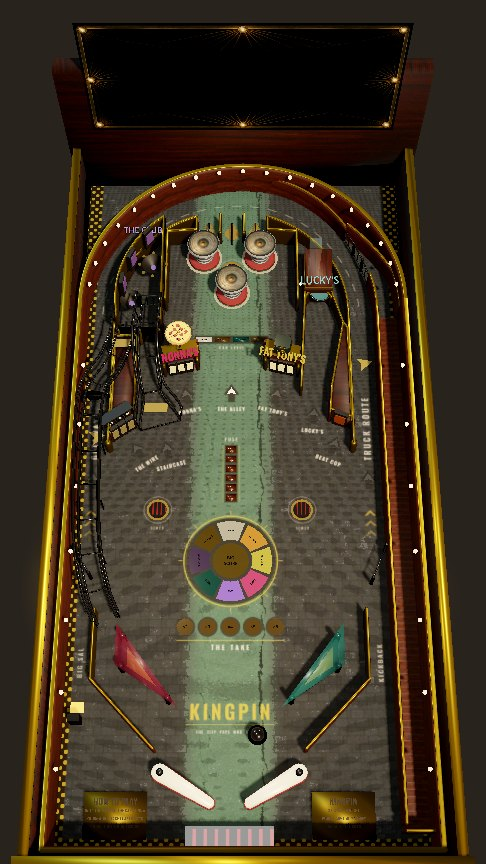
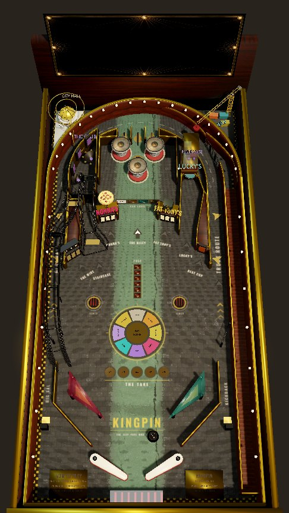

# 19 — The Racket: a board that develops

> **CITY PLANNING OFFICE, MEMO** — *"Re: the arcade on 5th. We tore it down to the studs.
> The new machine lights up a little more every time somebody does a job. By the end of the
> night it is brighter than City Hall. City Hall has complained."*

Status: design of record for the rebuilt table and the Night rules. It supersedes the shot map
in [specs/table-3d-flow.md](../specs/table-3d-flow.md) §3 and the passive jobs of
[05](05-MODES-AND-EVENTS.md) §1. It keeps the physics invariants (Jolt at 240 Hz, 1 u = 10 cm,
6.5° pitch), the portrait camera, the economy's two currencies and the flow signals.
Images: `docs/img/19/`.
[20](20-SHOTS-YOU-CAN-MAKE.md) supersedes the shot table and flow of §3.1, the tower's side-door
exit in §3.3 and the doorway banks: v5 lays the shots out as a fan round Lucky's, the shops pay
on their drop banks, and the washed ball comes up in the Alley.

**In one paragraph.** One premium machine, built the way *3D Pinball: Space Cadet* built its
table: a dense single board whose lights, bumpers and shots *develop during every game*, and
whose rank climbs by completing missions played **on the table**. In KINGPIN the missions are
**Jobs**:
- You pick a job at the payphones and take it at Lucky's.
- You beat its fuse by hitting the shots it lights.
- Three jobs in a Night light **the Big Score**.

Underneath that Night loop the empire still grows between Nights. Each career rank builds the
next district onto the same board: the Alley, the Corner, the Numbers, the Block, the Club, the
Docks, the Penthouse and City Hall.

---

## 1. Why the old table failed

Measured with the probes `tests/probe_flip.tscn` and `tests/probe_shots.tscn` on commit `4ec0ef7`:

1. **Shots could not be made from the flippers.**
   - A flip off the resting bat left at 8–24 u/s, always 18–41° cross-field.
   - The Staircase needed ≥ 24 u/s *at its mouth*. The sim proved it by teleporting a ball there
     at 32 u/s.
   - From real inlane feeds, 59–65 % of flips drained.
2. **The trap was broken.** A trapped ball wedged on top of the flipper pivot, so a reflip
   produced a 0.5–5 u/s dribble.
3. **Flipper upgrades were placebo.** `Flipper.power_scale` was written and never read.
4. **The pops did not work as pops.**
   - Three cans stood far apart in open floor, so a ball hit one and left. There was no nest and
     no chatter.
   - Nothing fed them except the plunge, and nothing upgraded them.
   - The can's solid post was about two-thirds the width of the can you see, and each kick was
     a fixed shove added to whatever speed the ball already had.
5. **Nothing developed during a game.**
   - Jobs were passive slips rolled before the Night.
   - The table had no lanes to complete, no multiplier to build and no mission lights.
   - Rank moved only in menus.
6. **Upper levels were corner shelves.** The Club, the Penthouse and City Hall were boxes bolted
   into the corners, joined by a tangle of wireforms that hid the storefronts at phone scale.
7. **The bare table looked unrendered.**
   - Neon triangles served as slings.
   - The apron cards were white boxes.
   - There were no inserts.

## 2. What we take from Space Cadet (and why)

From the open reconstruction of the original table rules (`k4zmu2a/SpaceCadetPinball`,
`control.cpp`):

| Space Cadet | Why it works | KINGPIN |
|---|---|---|
| Three **attack bumpers** in a tight triangle (two up, one down) at the top centre, walled in by the ramp structures on both sides | The ball rattles for seconds. Every hit is loud, the score climbs visibly, and you can *aim* into the nest | **The Alley**: three trash cans in the same triangle, walled in by the Club and the Tower |
| Three **re-entry lanes** right above the bumpers; lighting all three raises the bumper level (0–3); the level **decays every 60 s** | The lanes and the pops feed each other. The board brightens, then fades if you stop feeding it, so there is constant pressure | **Drop-Off lanes** upgrade the cans: *Trash Can → Dumpster → Armored Truck → Vault*, decaying every 60 s. The flipper buttons rotate the lit lanes |
| A **launch ramp** into a second enclosed bumper area that exits by the bonus lane to the left flipper | A reward area you can *reach* with a shot and that returns the ball safely | **The Staircase** to **the Club**: three slot-machine pops and the roulette; the cashier lane returns the ball to the left inlane |
| **Mission targets** choose a mission; the **launch ramp** accepts it; **fuel** runs out and aborts it | Missions tell you what to shoot, the fuel makes it tense, and the rank climbs | **The Wire** payphones choose a Job; **Lucky's** takes it; **the fuse** burns down |
| Every system is a **group of three lights**: boosters, medals, multiplier, fuel, missions, hazards | The board is covered in small promises you can finish | Drop-Off lanes, the storefront banks, payphones, sewer manholes, Pier 9 containers, the Empire Wheel |
| **Wormholes**: three sinks that teleport the ball | Surprise that stays readable, because the destination is lit | **The Sewer**: three manholes; the lit one is where you come up |
| **Kickbacks** in both outlanes re-arm on a timer | Generous and visible second chances | Big Sal, the Enforcer (left), and the Right-Hand Man (right) |

We keep KINGPIN's own ideas where Space Cadet has nothing: **dirty and clean money**,
**named crew as balls**, **Heat** and raids, and a table that **physically grows** with the career.

## 3. The table (full build)

The plan above is drawn from the built table's colliders (the full build, every piece bought).
The board has five horizontal bands:
- **The Gutter** (bottom): bats, Corner Boys slings, inlanes and outlanes with Guard Rails,
  both kickbacks, and the storm-grate drain. Calm and dark, with nothing taller than 0.35 u.
- **The Street** (lower middle): the insert field. It holds the **Empire Wheel**, the eight
  districts round a BIG SCORE centre; **the fuse** (the Job timer, six inserts up the centre); the
  **Take multiplier** row (×2 ×3 ×4 ×5 ×8); and two **sewer manholes**.
- **The Block** (the shot line): nine arrowed shots across the width, each named on the
  playfield under its arrow.
- **Uptown** (inside the ring road): the Club (left), the Alley (centre), Lucky's Tower (right).
- **The crown** (outside the arch): City Hall's rotunda in the top-left corner and Pier 9's
  crane in the top-right, both hooked onto the ring road.

### 3.1 Shots

Each bat's shot is set by where the ball meets it (§7): about 36° cross-field off the base of
the bat, through 22° at mid-bat, to about −4° off the tip. The right bat mirrors the left. From
a trap, flipping later and later walks each bat's fan: the far orbit, the near side target (the
Beat Cop or the Wire), Lucky's or the Staircase, the near doorway, and the Alley off the tip
(`tests/probe_shots.tscn`). The machine sim's aim scenario checks that a trapped ball can be
flipped into every shot below.

| Shot | Entrance | Flipper | Path → exit | Reward | Miss |
|---|---|---|---|---|---|
| **GETAWAY** (left orbit) | 0.40 u lane at x −2.32 | **R**, late (base of the bat) | Up the left lane over the NUMBERS spinner, round the ring road, down the right lane → the lane return → right inlane (a loop back to the same bat) | Orbit value, Getaway chase; a double opens the Sewer | Clips the lane post and drops back to the left inlane |
| **STAIRCASE** (left ramp, R4) | Flared mouth at (−1.30, −0.85) | **R**, mid-bat | Ramp onto the Club deck (0.50 u) → reels, roulette, back room → the cashier lane, over the Getaway lane → left inlane | Casino: reel standups, roulette bets (dirty in, clean out) | Rolls back out of the mouth toward the right bat |
| **NONNA'S** (doorway bank) | A shop doorway left of centre | Either bat | Three drops across the doorway → the door opens → a ball through the back door collects | Collection; advances the **Take** | Ball rebounds into the Street |
| **THE ALLEY** (centre) | Open plaza between the shops | Either bat, near the tip | Up through the plaza into the bottom can → the nest | Can hits × can level | Rebounds straight down the middle (the centre risk) |
| **FAT TONY'S** (doorway bank) | A shop doorway right of centre | Either bat | As Nonna's | Collection + Pawn mystery; advances the Take | As Nonna's |
| **LUCKY'S** (wash scoop) | Lane x 0.92–1.45 to the tower's scoop | **L**, mid-bat | Scoop → **drum** (the ball tumbles) → **lift** → side door into the Alley, or up to the roof when it is lit (R6) | **Wash** (dirty → clean); **takes a Job**; starts the Big Score | A ball outside the lane rattles off the tower wall |
| **TRUCK ROUTE** (right orbit) | 0.40 u lane at x 1.94 | **L**, late | Up the right lane, round the ring road (where Pier 9's crane can take it), down the left lane over the spinner → left inlane | Orbit value; Pier 9 shipments (R5) | As the Getaway |
| **THE WIRE** (3 payphones) | The island left of the Staircase | **R**, mid-bat | Standups | **Picks a Job** (each phone is a line) | — |
| **BEAT COP** (standup) | The island right of Lucky's lane | **L** | Standup | Bribe: Heat −20 for dirty | — |
| **THE DROP-OFF** (plunge) | Shooter lane → launch flaps in the ring road's rail | Plunger | Weak (≈ 0.50–0.555): back down the right lane. Medium (≈ 0.56–0.585): into a Drop-Off lane. Hard (≈ 0.59 and up): round the ring to the Getaway lane. The rubber band's three pulls are 0.53 / 0.57 / 0.80 | Lit lane = skill shot (☆ and a free can level). The flipper buttons move the lit lane while the ball is on its way | — |

**Flow.**
- Each orbit returns to the bat that shot it, so orbits are repeatable combo builders.
- The Staircase and the Club send the ball to the *left* bat. The Alley and Lucky's spill into
  the centre, so the next shot is the player's choice.
- The ring road carries the plunge, both orbits, the Drop-Off lanes, Pier 9 and City Hall.
  Every Uptown exit ends at a flipper.

### 3.2 The Alley: a bumper nest that works

The nest's geometry is set so the ball *chatters*:
- **Cans:** radius 0.25. The top pair's centres are 0.94 u apart and the bottom can sits 0.83 u
  from each, so the gaps are 0.33–0.44 u, 1.2–1.6 balls. The side walls sit 0.36 u off the top
  cans.
- **Lanes:** the three Drop-Off lanes drop balls onto the upper cans. A pop that throws a ball
  upward can send it back up a lane into the ring road, the classic escape.
- **Kick:** each can fires on real contact with its post. It throws the ball out along the
  contact normal at a *consistent* speed, a fixed kick plus a share of the approach speed, keeping
  most of its slide, the same model as the slingshots. It no longer adds a shove to whatever
  speed the ball already had.
- **Upgrade:**
  - Light all three Drop-Off lanes and every can goes up a level:
    - Trash Can pays 1× and has a dull lid.
    - Dumpster pays 2× with an amber lid ring.
    - Armored Truck pays 4× with a teal ring.
    - Vault pays 8× with a gold ring and a gold lid.
  - A level decays every 60 s.
  - Four level inserts at the plaza mouth show where you are, and the flipper buttons rotate the
    lit lanes, as they do on a real machine.

### 3.3 The signature: Lucky's Tower (the wash and the lift)

1. A ball into Lucky's scoop is *taken* by the drum. Through the tilted porthole the player
   watches the named ball tumble in suds and bills for 1.2–2.4 s while the wash counter rolls.
   This is when `laundromat_pass` fires.
2. The glass **service lift** raises the ball, and a brass floor dial shows where it is going:
   - **1st floor:** out of the side door into the Alley.
   - **Roof (R6), when it is lit:** the Penthouse (next).
3. **The roof.** A can level of 2 or a finished Job lights the roof. A lit lift carries the ball
   up to the Penthouse's glass room and starts a 45 s Sit-Down. Five named shots (Getaway,
   Staircase, Nonna's, Fat Tony's, Truck Route) each take a family's chair: the Moretti, Vallone,
   DeLuca, Ferrante and Gallo tables. Take all five and the families back your run for City Hall:
   the election opens ([05](05-MODES-AND-EVENTS.md) §8). The room drops the ball back into the
   Alley.
4. **The tower grows** with the career:
   - R0: a dark one-storey laundromat, CLOSED.
   - Coin-Op (the Ledger): LUCKY'S neon and a working drum.
   - R6: the Penthouse glass room on the roof.

### 3.4 Warps and small areas

- **The Sewer** (R3, dug by the Protection racket):
  - Three manholes: left Street, right Street, and one inside the Alley.
  - Two Getaways inside 15 s open the sewer (one, with *Know the Tunnels*). A ball that rolls
    over a lit lid drops in, goes under for a beat and comes up through the Alley manhole, among
    the cans.
  - A lit lid is the only open one.
- **The Club** (R4): a walled casino strip on its own raised deck, entered by one shot and left
  by one lane, the way Space Cadet's launch area works. Three reel standups, the roulette
  saucer and the back room; whatever rolls down the deck goes home through the cashier.
- **Pier 9** (R5):
  - The crane's magnet takes a Truck Route ball (one its own eye saw come up the right lane,
    so the pier works from the day it is bought) off the top of the ring road, swings it over
    the quay and loads a container: a visible lock that opens a 40 s smuggling run.
  - Three containers loaded ships the load and pays it. A Getaway during the run sends the
    load to the truck and doubles it.
  - Each load, the crane drops the ball back onto the ring road.
- **City Hall** (R7): a gate on the ring road's left arc takes a full-speed (≥ 21 u/s) Getaway
  up a wireform round the rotunda and back onto the ring road; a slower one rolls on past. It
  is the hardest shot on the machine.

## 4. A Night (the loop)

1. **Roll Call.** Pick the crew and see **Tonight's Work**: three Jobs, one per payphone line.
2. **The Drop-Off.** Plunge for the lit lane.
3. **Earn dirty.** The cans (× can level), the spinner, the orbits, the Club, the banks. Job pay
   and jackpots are multiplied by **the Take**, which climbs one step per doorway cash-out and
   resets when a guy's ball is over; everything rides the **Heat** band.
4. **Pick a job.**
   - Hit a payphone: its line rings and that Job is selected. Its shots light and flash on the
     arrow inserts, and its district flashes on the Empire Wheel.
   - Shoot **Lucky's** to take it. The fuse lights, full.
5. **Work the job** before the fuse burns out:
   - 60–100 s per job (a third longer with *Slow Burn*), extended by the NUMBERS spinner
     ("buying time": 0.35 s a tick, up to 20 s a Job).
   - Success pays Respect ☆ and cash, and marks the line done.
   - Failure puts the line back on the board (no penalty but time).
6. **Launder at Lucky's.** Every trip through the drum washes dirty into clean, capped per
   Night, and more with upgrades. Held dirty is what a raid takes.
7. **The Big Score.** Finish all three of Tonight's Work and BIG SCORE lights in the middle of
   the Wheel. Lucky's starts it: a second ball comes in and every arrow on the table lights for
   a jackpot. Collect them all and **the vault** opens at Lucky's, worth five jackpots, and the
   arrows relight. It is the Night's finale and the reason to play one more.
8. **The Count.** Tally, pocket-money wash, Respect, rank-ups (with the Commission boss from R3),
   the headline.
9. **The Ledger.** Clean cash builds the empire onto the board.

## 5. The career: the board physically develops

Each rank builds its district; the Ledger fills in the details between ranks.

| Rank | District | Built onto the board |
|---|---|---|
| R0 Lookout | **The Alley** | The gutter, the ring road, the nest with one can, the Drop-Off lanes, shuttered shops, the Staircase and Lucky's boarded up. The T0 furniture is in the Ledger. Lucky's opens (drum, lift, wash) with the Coin-Op front once you are holding dirty money. The Wheel shows ALLEY only |
| R1 Errand Boy | **The Corner** | The NUMBERS spinner |
| R2 Numbers Runner | **The Numbers** | THE WIRE payphones (Jobs go live on the table: they need the payphones and Lucky's) and the Beat Cop |
| R3 Soldier | **The Block** | Protection: the Sewer, then Nonna's and Fat Tony's doorway banks (the Take); the Getaway Loop; first boss |
| R4 Capo | **The Club** | The Staircase and the Club deck (reels, roulette, back-room lock → Family Meeting multiball) |
| R5 Underboss | **The Docks** | Pier 9 (crane and containers, smuggling runs), then the Truck Route |
| R6 Boss | **The Penthouse** | The tower roof: the Sit-Down and the five chairs |
| R7 Kingpin | **City Hall** | The rotunda and its dome loop; Empire Mode; Skip Town |

The same machine at R0, R3, R4 and R7, captured in game at phone size:

| R0 | R3 | R4 | R7 |
|---|---|---|---|
|  |  |  |  |

**The Ledger is re-cut to the new board.**
- *T0 furniture:* cans 2 and 3, Corner Boys, Guard Rails, Chalk Lines (lane lights and lane
  change), the Real Plunger.
- *Board-development upgrades:*
  - *Full Load*: a lit can level holds twice as long before it fades
  - *Slow Burn*: every Job's fuse burns a third longer
  - *Know the Tunnels*: one Getaway opens the Sewer
  - faster kickback re-arm (Big Sal)
  - a faster wash cycle and bigger loads
- The existing economy nodes (safe, bench, Inspector, crew, casino edge) carry over.
- Flipper power (*Fresh Rubbers*, *Steel Toes*) now really strengthens the stroke.

## 6. Light, material and identity

- **Look.** It is *a 1970s paperback city block, built like a 2025 premium machine*:
  - A printed playfield over the street: the shot names under their arrows, GETAWAY and TRUCK
    ROUTE up the orbit lanes, black keylines round every insert, the Empire dial's brass bezel,
    the fuse channel, the Take rail and the KINGPIN wordmark between the slings. It is painted
    from the table's own geometry (`bash tools/texgen/playfield.sh`), so the art never drifts
    from the colliders.
  - Walnut rails, brass posts and guides, nickel wireforms, black rubbers, smoked sling
    plastics.
  - Shop doorways with ink-and-cream facades and neon signs.
  - Sculpted cans, a drum, the Pier 9 crane (a lattice mast and jib) and City Hall's rotunda
    (colonnade and ribbed gilt dome), all generated in Blender from `tools/meshgen/toys.py`.
- **Inserts carry state, one meaning each (P4):**
  - Unlit tinted glass means unavailable.
  - A slow pulse means available.
  - A fast blink means hurry-up or fuse.
  - Solid means done.
  - A police double-strobe means a raid.
  - Every state also has a shape or cadence cue: arrows, rounds, a bargraph, the Wheel.
- **Reserved colours stay semantic:**
  - Clean green only on a shot that washes right now.
  - Dirty red means a dirty jackpot.
  - Cop blue means the police and the PINCHED outlanes.
  - Heat ember means the fuse and the bribe.
- **District colours are free for signage:** teal (Lucky's, Pier 9), rose (Nonna's, the Club),
  amber (Fat Tony's, orbits), violet (the Club, the Penthouse), gold (City Hall).
- **Light budget.** The ball stays the brightest steel on the board. Neon appears only where a
  district is owned; everything else is warm tungsten GI. A district the empire holds glows low
  on the Wheel; only what is happening now is bright.

## 7. Implementation

**Systems that change.**
- **Feel** (`game/core/feel.gd`, `flipper.gd`):
  - `FLIPPER_UP_EASE` 1.45 → 2.0, `FLIPPER_BOUNCE` 0.12 → 0.30 and `FLIPPER_UP_TIME`
    0.045 → 0.034 s. The faster stroke is what makes the orbits: a late flip used to reach the
    lane at 16 u/s and arrive at the ring too slow to go round.
  - **Designed aim.** Physics alone sent every reflip 30–38° cross-field. `FLIPPER_SHOT_CURVE`
    maps where the ball meets the bat to a heading, and the flipper bends the outbound heading
    90 % of the way to it, keeping the speed. Aim is learnable: late is cross-field, early is
    up the middle.
  - **Trap assist.** A held bat's rubber grips a slow ball, damping its roll toward the tip.
  - `power_scale` applied to the stroke.
  - Inlane sweep ends moved so a trapped ball rests on the bat.
- **Walls** (`wall_builder.gd`): a chain of three or more points is one mitred trimesh, not a
  box per chord. Jolt's inactive-edge handling then stops a fast orbit catching on the joins, a
  "ghost contact" that used to cost a third of its speed on the ring road.
- **Orbit throats** (`LaneMouth`). The lane guides stop at z −0.45, clear of the cross-field
  shot line. A rising ball that reaches the outer wall rides a 1.2 u curve up the lane with its
  speed and spin, where the straight wall used to take a third of it; a ball coming back down
  never meets the curve, so the lane returns still feed the inlanes.
- **The launch merge.** Five flaps span 305°–345° of the rail. Along them the shooter lane's
  outer wall closes at a steady 13° until its face is flush with the rail's inside, and it is
  one piece with the upper rail, so the plunge is handed onto the ring road riding the rail. It
  used to stop at the rail's outer face, leaving the ball overlapping the rail where it resumed:
  the plunge hit the rail's end head on, after clipping a step where the lane's top was
  narrower than the lane. A full pull now crosses the top of the ring at about 19 u/s instead
  of losing most of its speed at the flaps.
- **One rail, two shapes.** The flaps only swing and decide. They read a ball's side against
  the whole rail rather than their own chords, open for a ball not yet a full ball inside, and
  fall shut once no ball is near. The rail through them is solid in one of two seamless shapes:
  shut, it runs unbroken from the arch to the divider; open (while any flap is), it stops either
  side of the flaps and the lane's closing wall carries the plunge onto it. Solid blades with a
  post at each end used to stand in the rail, and an orbit pressed against it caught a post at
  every joint (a hot Getaway fell from 14 to under 8 u/s crossing them). The arch and the cabinet's sides,
  and the rail and the shooter lane's divider, are single chains for the same reason.
- **No pockets.** Each shop's back falls toward the plaza, so a ball behind Fat Tony's or
  Nonna's rolls off the inner end and back down between them; the back door opens on a hair
  for a ball on the shop floor. The Staircase has stringers: its sides run down to the
  playfield wherever its floor is raised, so nothing rolls under it. The nest's shoulders meet
  the side walls below the upper cans' middles, which ends a loop where a can kicked the ball
  up into the corner under the lane block and the wall sent it back. `machine_sim` drops balls
  across the board and fails any that park or stay caged in a small box for 2.5 s.
- **Table** (`game/table/`):
  - `layout.gd` rewritten.
  - `progression_table.gd` rebuilt for the new board.
  - `Bumper` fires on contact with a consistent kick and carries a level.
  - New pieces: `LuckyTower` (drum and lift, carrying the ball out of physics and handing it
    back at an exit), `Manhole` (warp), `Docks` (Pier 9's crane lock), `CityHall` (the dome
    loop), `ClubDeck` (strip casino), `Penthouse` (the Sit-Down), `Storefront` (doorway banks),
    `InsertField` (lamp groups: arrows, the Wheel, the fuse, the Take, the can levels),
    `PathRide` (the scripted carrier they share) and `OneWayGate` flaps for the lane returns,
    the shooter lane's merge into the rail and the Club's entry.
  - The table owns **board state**: can levels and decay, lane lights and lane change, the Take,
    manholes, kickback charge.
- **Flow** (`game/flow/`): Jobs become active missions. Lines are *offered* at Roll Call,
  *selected* at a payphone, *accepted* at Lucky's, *run* against the fuse, then *done* or
  *blown*. `night.gd` wires the new table signals and the Big Score. Signal names the rest of the
  game listens to are kept.
- **Content:** `table_jobs.json` (17 Jobs), `upgrades.json` (the Sewer on Protection, *Full
  Load*, *Slow Burn*, *Know the Tunnels*).
- **Tests:**
  - `machine_sim` is rewritten for the new board: 15 scenarios, from the Drop-Off ladder and
    the nest's chatter to every piece's round trip, the aim fan of both bats, no resting pockets
    and dormancy.
  - `test_table_jobs` walks the Job rules shot by shot, then the money against `Game` and the
    save.
  - The night sims drive the new job loop.
- **Performance** (GL Compatibility, low-end Android):
  - Hardware ≤ 1,500 tris a piece and toys ≤ 3,000.
  - Lamp states are emissive material parameters, not lights. Real lights stay within the
    RenderProfile caps.
  - One playfield texture.

## 8. Tradeoffs

- **Scripted carriers.** The drum, the lift and the crane move the ball on rails. This exception
  is scoped to capture mechanisms, like a real VUK or magnet; physics owns the ball everywhere
  else, including every exit.
- **A livelier flipper.** Rubber now throws the ball harder and bounces more. The feel sim keeps
  trap and catch honest, and final values want hands on a device.
- **Designed aim over raw physics.** The shot curve makes aiming learnable and every shot
  reachable, at the cost of some of the chaos a purely physical bat throws. A slow dribble
  (under 5 u/s) is left to physics.
- **Jobs on the table ask more of new players than passive slips.** Mitigations:
  - R0 and R1 have no table Jobs; the payphones arrive at R2. Until then Roll Call's contract
    slips set the Night's objective, and the HUD hands over to the Wire's Jobs once they are
    live.
  - The first Job is taught by the coach.
  - A blown fuse costs only time.
- **No ramps before R4.** The early board is orbits, the nest and the wash. Boarded-up routes
  keep the future visible and still score as targets.
