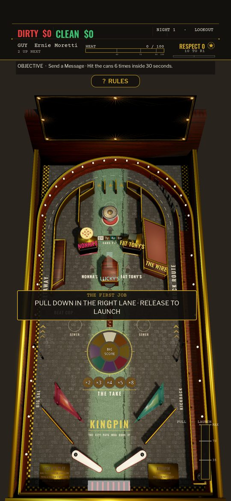
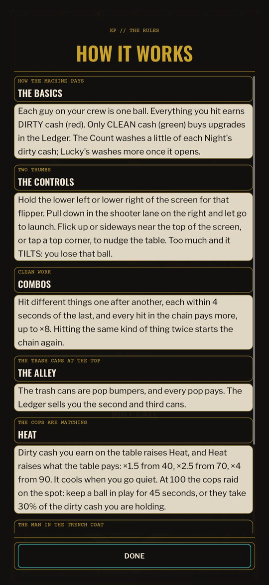

# 20 — Shots you can make: the v5 board

> **THE WIRE, PAGE 6** — *"Players at the machine on 5th say the new one is 'fair'. Nobody on 5th
> has ever said that about anything. Detectives are looking into it."*

Status: design of record for the v5 board and its rules. It supersedes the shot table and flow
of [19](19-PLAYFIELD-REDESIGN.md) §3.1, the tower's exit in 19 §3.3 and the Collection Round of
[05](05-MODES-AND-EVENTS.md) §3. Everything else in 19 stands: the developing board, the career
table (19 §5), the invariants (Jolt at 240 Hz, 1 u = 10 cm, the portrait camera) and the
economy's two currencies. Images: `docs/img/20/`.

**In one paragraph.** v4 had the right idea (a Space Cadet board that develops as you play)
but it was hard to play. The main shot could barely be made, the pops threw the ball back at
the flippers, the words on the lamps were too small to read on a phone, and Collection almost
never started. v5 rebuilds the shot line as a **fan**:
- Each flipper's aim is shared out among a few big targets.
- **Lucky's** stands in the middle and belongs to both flippers.

On top of that:
- The pops are tamed.
- The shops pay on their drop banks.
- The rules can be read on the machine itself.

---

## 1. What the great machines do, and where v4 fell short

| What great machines do | v4 | v5 |
|---|---|---|
| **A few big shots, laid out as a fan.** Each flipper reaches several targets at different points along the bat, and every shot exists for a reason. | Nine targets crowded the shot line, and the right bat could not make Lucky's at all (§3.1). | One target per slice of each bat's aim (§3). The Alley is fed rather than aimed at. |
| **The feature shot is the surest shot on the board.** Medieval Madness's castle and Attack from Mars's saucer sit dead centre and can be made from either flipper. | Lucky's was a side lane that only the left bat reached, for 10 ms of flip timing. | Lucky's is the front door of a tower in the middle of the Street, made from either bat (§3.2). |
| **Pops are a rest stop.** The ball rattles, scores and advances something, then comes out slowly. | The cans fired a ball back up its lane or down the plaza at the flippers within a third of a second. | Softer kicks and a slower exit (§2). |
| **One light language.** A flashing arrow means shoot it now; a lamp says a word or a number you can read at a glance. | District names at 22 px and level digits at 20 px on the inserts. Printed shot names at 0.062 u, turned along their arrows. | Big outlined numbers on the lamps, 0.10 u names, no small words (§6). |
| **The machine tells you what to do.** The display names the current objective, and the rules can be looked up. | A running Job only showed when nothing else did: the Wire's draws and the casino's streaks took the objective line first. Nothing explained the board. | One objective, chosen by what you can act on, plus a HOW IT WORKS sheet (§5). |
| **Modes start on a shot and cost only time.** You shoot something to start a mode, run a clock, and a failed mode just ends. | The Collection Round started by itself when every bank stood at once. A boarded-up shop counted as standing, so every Night opened on a round nobody could play. | The first shop you collect starts the round (§4). |

## 2. The pops: a rest stop, not a cannon

A can fires on real contact with its post. It throws the ball out along the contact normal at
a fixed speed plus a share of the approach speed, keeping part of the slide round the can (19
§3.2). v5 only turns the numbers down, all in `feel.gd`:

| | v4 | v5 |
|---|---|---|
| `BUMPER_KICK_SPEED` (u/s out along the normal) | 17.0 | 10.0 |
| `BUMPER_KICK_GAIN` (share of the approach speed) | 0.35 | 0.20 |
| `BUMPER_TANGENT_KEEP` | 0.85 | 0.80 |
| `BUMPER_OUT_MAX` (u/s) | 30.0 | 16.0 |

**Measured** with the nest probe: 36 feeds, 24 down the three Drop-Off lanes and 12 up the
plaza.
- 25 feeds entered the nest and scored about **7.5 pops per visit**.
- The ball came out of the bottom at a median **7.1 u/s**, a speed a flipper can trap.
- 9 feeds left back up a lane, the classic escape.

One-way gates at the lane mouths were tried and dropped: a ball kicked back up met a closed
gate and was caged for good.

Lucky's feeds the nest too. The washed ball leaves through the tower's basement and comes up
the Alley's third manhole (`MANHOLE_AT[2]`) at 4.5 u/s, in a direction drawn from a seeded
random generator. The v4 exit was a side door, and it gave only 1–3 pops.

## 3. The shot map is a fan

Each bat's aim is shared out among a few big targets, base of the bat to tip. The most
important target gets the widest slice, and **Lucky's**, in the middle, belongs to both:

- **Right bat:** Getaway · Beat Cop · Staircase · Nonna's · **LUCKY'S**
- **Left bat:** Truck Route · the Wire · Fat Tony's · **LUCKY'S**

The islands (`layout.gd`) are placed along those headings:
- **The Beat Cop** is on the left beside the Staircase, square to the right bat.
- **The Wire's brownstone** is on the right, square to the left bat. Its back runs up to the
  nest wall and closes the corner behind Fat Tony's.
- **Nonna's and Fat Tony's** are solid islands either side of the plaza. Each faces the far bat
  with a three-drop bank, and each shop's back falls toward the plaza, so a ball can't lodge
  behind it.
- **The Staircase's mouth** sits at (−1.42, −0.85). Its flare is 0.56 u wide, narrow enough to
  keep clear of the line from the right bat to Nonna's.

The v5 board on Night 1 at 1080 × 2340, with the RULES tab under the objective line:

### 3.1 The aim

`Feel.FLIPPER_SHOT_CURVE` maps where along the bat the ball lies (t = 0 at the pivot to 1.1
past the tip) to a heading. It is written as one run per target, with steps over the headings
that would only find a post or a lane guide. Two things make it hold on the real table:

1. **The contact is read at the press.** `Flipper._fire` records t for a ball already touching
   the bat. v4 read it mid-swing, after the bat had moved: t jumped 0.1–0.27 and landed in the
   next target's run.
2. **The orbits start where the pace is.** The speed off the bat is about 9.5 + (t − 0.19) · 51
   u/s, and an orbit needs 21 u/s to get round (t ≥ 0.45). The runs for the far orbits start
   there.

**Measured** (`tests/probe_shots.tscn`, `PROBE_STEP=0.01`, both boards run by the same probe).
Each cell is how many milliseconds of flip timing reach the shot. The three numbers are three
feeds: from a trap (re-flipped 0–0.9 s after the release), from an inlane roll, and on the fly.
- Ramps, orbits and Lucky's count when the shot is made.
- Drop banks and standups count when the flip hits them. A shop's shot is its bank, even
  though only the third drop pays.

| Shot | Bat | v4 (trap / inlane / fly = total) | v5 |
|---|---|---|---|
| **Lucky's** | left | 10 / 0 / 0 = **10** | 90 / 50 / 50 = **190** |
| **Lucky's** | right | 0 / 0 / 0 = **0** | 90 / 50 / 50 = **190** |
| Getaway | right | 50 / 20 / 40 = 110 | 60 / 50 / 40 = 150 |
| Truck Route | left | 20 / 20 / 30 = 70 | 50 / 30 / 20 = 100 |
| The Wire | left | 30 / 0 / 10 = 40 | 30 / 30 / 30 = 90 |
| Beat Cop | right | 10 / 0 / 0 = 10 | 40 / 20 / 20 = 80 |
| Staircase | right | 10 / 10 / 10 = 30 | 40 / 10 / 10 = 60 |
| Nonna's | right | 10 / 0 / 0 = 10 | 30 / 20 / 10 = 60 |
| Fat Tony's | left | 20 / 10 / 10 = 40 | 20 / 20 / 10 = 50 |

**The Staircase needs pace.** A ball slower than about 34 u/s enters the mouth and rolls back,
so the ramp can't take anything nearer the pivot than t 0.67. From the right bat's release point
the mouth accepts headings of about −17.25° to −14.5°. The Staircase's run spans that whole
band, from t 0.64 to 0.76, and the shop's run starts after it.

`tests/sim/machine_sim.tscn`'s aim scenario checks that each bat reaches every shot in its
fan from a trap.

### 3.2 Lucky's Tower

The tower (`segments/lucky_tower.gd`) stands in the middle of the Street:
- **The front door is a scoop box** the full width of the front (0.51 × 0.10 u at z −0.72).
  Any ball that reaches the door is taken; the probe counts the shot on entry.
- **The drum is at the front** behind the porthole, and **the lift is at the back**.
- **The roof rises to a ridge** offset to x −0.245. A centred ridge let a ball balance on it.
- **Out:** the lift sinks into the basement (0.30 s), the ball runs under the plaza (0.35 s) and
  comes up the Alley's third manhole (§2).
- **Up:** with the Penthouse lit, the lift goes up first (19 §3.3).

### 3.3 The shops

A shop is a solid island with a **three-drop bank** across its front (`hardware/storefront.gd`):
- The **third drop pays** the shop's protection on the spot, and PAID lights on the front.
- The bank comes back up after **12 s** (`rearm_seconds`).
- A paid shop advances **the Take** one step.

v4's doorway (drops, then a door, then a ball through the back) took four shots and a lucky
bounce. The balance sim counted it as four shots; v5's bank is three.

## 4. Rules: Collection and Jobs

**The Collection Round** (`flow/collection.gd`):
- **Start:** the first shop you collect starts a 25 s round, provided a second shop can pay
  tonight. A shop that isn't bought, or is boarded up, doesn't count.
- **Win:** collect the other shop before the clock runs out. The last collect pays its value
  again, and the back room lights.
- **Respect:** the first perfect round of a Night is worth ☆10 and the rest pay money only. A
  repeatable ☆10 made the block most of a career's Respect.
- **Lapse:** a lapsed round costs nothing. There are 8 s of quiet (`RETRIGGER_GAP`) before a
  collect can start the next one.

**Jobs.** Lucky's no longer waits for a payphone. With no line rung, it gives you the next open
Job (`TableJobs.on_lucky`). The payphones choose which Job; they aren't a gate. A v4 player who
never hit a payphone never saw a Job at all.

**Balance** (`tools/balance.sh --days 14 --seeds 2`, v4 rules vs v5 rules, on the same v5
board):

| profile | Collection's share of Respect | the shops' share of career dirty | R4 / R5 reached |
|---|---|---|---|
| duffer | 4% → 17% | 6% → 10% | never → never |
| decent | 51% → 47% | 65% → 79% | day 5 / 8 → day 5 / 6 |
| shark | 27% → 27% | 59% → 70% | day 2 / 3 → day 2 / 2 |

- A weak player now wins rounds; under v4 rules they almost never did.
- The pace targets in [03](03-ECONOMY.md) §9 keep their verdicts.
- The shops earn more for good players. That is a tuning follow-up (§8), not a pacing break.

## 5. Saying what the machine does

**The objective line.** Every HUD producer stays live, but the line shows the first one with
something to say, in this order:
1. A Commission fight.
2. The Job whose fuse is burning, or the Big Score.
3. A live Collection Round.
4. The Family Meeting.
5. The endgame modes (Federal, Empire, heist, Docks, City Hall, the ritual).
6. What Lucky's will start next ("SHOOT LUCKY'S FOR A JOB: …").
7. The casino and the Wire's draws, which happen whatever the player does.

Before any Job exists the line says the one thing worth knowing: shoot Lucky's to wash your
dirty cash. Job lines name shots the way the playfield prints them (`TableJobs.shot_name`).

**HOW IT WORKS** (`ui/rules_sheet.gd`) is one card per thing on the board, in the order the
Ledger builds them.
- **Gating:** a card needs its hardware. `needs` means any of the listed pieces is built;
  `needs_all` means every one is. Collection needs both shops; Jobs need the Wire and Lucky's;
  the Sewer needs the Getaway that opens it. What isn't built yet is named in one line at the
  end, so the sheet grows with the table. `tests/test_rules_sheet.gd` holds the gating.
- **Opening it:**
  - From the front door, with the HOW IT WORKS button beside HOUSE RULES.
  - Mid-Night, from the **RULES tab** under the objective line. The Night pauses while the
    sheet is open.
- **Where the tab sits:** in the middle third of the screen. The top corners are the tap-nudge
  targets (`InputController.NUDGE_CORNER_WIDTH`), and a tap up the middle does nothing else.
  The device probe taps it through the real touch pipeline and checks that it opens the sheet,
  pauses the table and never nudges.

A fresh career's sheet at phone size:

## 6. Readable on a phone

The rule is that a lamp carries a number or a word or two, sized for a phone; anything longer
goes in the HUD or the rules.

**Inserts** (`look/insert_field.gd`), outlined Label3D at the same pixel size:

| | v4 | v5 |
|---|---|---|
| The Take (×2 … ×8) | 40 | 92 |
| Can levels (1× 2× 4× 8×) | 20 | 78 |
| BIG SCORE | 40 | 64 |
| District names on the Wheel | 22 | removed |
| Shot arrows | 1.0× | 1.35×, Lucky's 1.9× |

**Printed playfield** (`tools/texgen/playfield_art.py`), cap heights in table units:
- Shot names: 0.10 u, printed level and nudged apart where two collided. v4 printed them at
  0.062 u, turned along each arrow.
- Lane names: 0.13 u (v4 0.10).
- Labels: 0.085 u (v4 0.04–0.07), including CANS PAY under the level inserts.

**The Ledger's hire photos** were drawn at 409 × 512 over the whole card. The photo set its
size before its expand mode, and a stray `z_index` lifted it over everything. They now sit in
their 58 × 76 slot (`Ledger.portrait_photo`), and `tests/test_ledger_cards.gd` holds them
there.

## 7. Verification

- `bash tools/check.sh --full`: the import, the unit suite and the boot smoke, plus every sim.
  `machine_sim` covers the fan, the nest, the Sewer, Pier 9, the roof, the dome, the shops,
  the kickback and no pockets.
- `tests/probe_shots.tscn` with `PROBE_STEP=0.01` gives the §3.1 table.
- The device probe, run at 486×864 (the ship gate) and at 1080×2340 (a phone), taps HOW IT
  WORKS and the RULES tab through the real touch pipeline.
- The balance sim gives the §4 table.

## 8. Open items

- **The Staircase and the shops are the thinnest key shots** at 50–60 ms. Every extra
  millisecond for one of them comes out of another, because the bat's aim is shared.
  - The mouth can't be widened without blocking the line to Nonna's again (v4's problem).
  - A slower climb, a lower deck or a shorter ramp would open the Staircase to slower balls.
- **The shops' share of income** for good players is 70–79% (§4). A lower collect value or a
  longer re-arm is the lever, if it needs pulling.
- **The compact HUD** is chosen by a window narrower than 720 px. A 1080-wide phone gets the
  standard strip, so the device probe's compact-HUD checks only hold at 486×864.
- **The empty backbox.** On a tall phone the camera frames the cabinet's black backbox glass
  above the table. It could carry callouts: the round clock, a Job's name, a jackpot.
